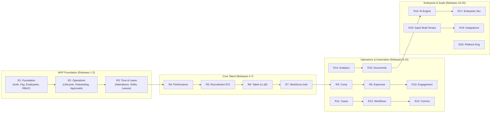

# PeopleOS — Product Requirements Document (PRD)

| Document Version | Product Stage | Target Audience | Authors | Status |
| :--- | :--- | :--- | :--- | :--- |
| **1.0.0** | MVP (Releases 1–3) to Enterprise (Releases 4–20) | Engineering, Product, HR Leaders, QA | Product Architecture Team | **Approved** |

---

## 1. Executive Summary & Vision

### 1.1 Product Vision
**PeopleOS** is an enterprise-grade Human Resources and Workforce Management platform designed to transition organizations from disjointed HR spreadsheets and point solutions into an intelligent, unified **Workforce Operating System**.

> **"Manage people. Understand workforce. Improve organizational performance."**

PeopleOS manages the end-to-end employee lifecycle while equipping leadership and department heads with real-time workforce visibility, predictive analytics, and automated compliance.

### 1.2 Core Philosophy
1. **Modular Monolith to Distributed Platform**: Start with a strictly modular architecture (NestJS + PostgreSQL) to ensure agility, transitioning gracefully to event-driven workers, distributed caching, and Kubernetes microservices as throughput scales.
2. **Audit & Compliance by Design**: Every state change, sensitive field update, and approval action is tracked immutably with timestamp, user ID, IP address, and old/new snapshots.
3. **Progressive Complexity via Releases**: The platform is grouped into 20 coherent, deliverable releases. **Releases 1 through 3** represent the operational **Minimum Viable Product (MVP)** capable of powering day-to-day HR for companies from 50 to 50,000+ employees.

---

## 2. Target Personas & Stakeholders

| Role | Primary Objectives | Key Pain Points Addressed |
| :--- | :--- | :--- |
| **Super Admin** | Platform-level management, global security settings, system health monitoring, cross-organization configuration. | Lack of central governance, security vulnerabilities, manual tenant setup. |
| **Org Admin / HR Admin** | Organizational hierarchies, policies, role assignments, employee provisioning, compliance enforcement. | Data fragmentation across tools, manual onboarding overhead, untracked changes. |
| **HR Manager** | Operational HR workflows, probation reviews, lifecycle transitions (promotions, transfers, exits), grievances. | Repetitive manual paperwork, missed probation review dates, exit process bottlenecks. |
| **People Manager / Lead** | Team availability tracking, attendance regularization, leave approvals, goal setting, 1:1 reviews. | No clear visibility on team leave overlap, delayed requests, lack of performance context. |
| **Employee** | Self-service profile updates, clock-in/out, leave applications, payslip/document retrieval, company directory search. | Friction in submitting routine requests, unclear leave balances, opaque approval tracking. |
| **Executive / Leadership** | Headcount velocity, attrition analytics, department capacity, compensation parity, workforce costs. | Stale monthly reports, lack of forward-looking capacity planning, siloed workforce insights. |
| **Auditor / Compliance** | Immutable activity logs, access history, statutory compliance, data retention review. | Incomplete logs, untraceable manual database modifications, security non-compliance. |

---

## 3. Product Goals & MVP Boundaries

### 3.1 Primary Goals
- **Single Source of Truth**: Centralize personal, employment, and structural data for every employee.
- **Automated Lifecycle Transitions**: Seamless progression from Offer $\to$ Pre-Joining $\to$ Onboarding $\to$ Probation $\to$ Confirmation $\to$ Active $\to$ Exit.
- **Operational Attendance & Leave**: Real-time punch records, shift rules, overtime, regularization, and multi-tier leave approval chains.
- **Security & RBAC**: Strict resource- and action-level permission controls with secure JWT authentication and password policies.
- **Management Visibility**: Role-tailored dashboards (Employee, Manager, HR) delivering actionable indicators.

### 3.2 Explicit Non-Goals for MVP (Releases 1–3)
The following capabilities are deliberately scheduled for subsequent releases to maintain rapid MVP delivery:
- Direct payroll processing, tax filing, and bank disbursements *(Release 8)*
- AI-driven resume parsing and conversational assistants *(Release 16)*
- Complex candidate pipeline / ATS job board integrations *(Release 5)*
- External SaaS multi-tenant billing and Stripe subscription metering *(Release 18)*
- Third-party chat bots (Slack/Teams interactive commands) *(Release 19)*
- Full microservice mesh with distributed tracing *(Release 20)*

---

## 4. Architectural Overview

```
                                  PEOPLEOS PLATFORM
                                         │
        ┌────────────────────────────────┼────────────────────────────────┐
        │                                │                                │
  [CLIENT LAYER]                 [API GATEWAY & CORE]              [DATA & WORKERS]
  • Web App (React 19 + Vite)    • NestJS Modular Monolith         • PostgreSQL 16
  • Tailwind CSS + Headless UI   • RESTful Controllers             • Redis 7 (Cache / Lock)
  • React Query (Server State)   • DTO Validation (class-validator)• BullMQ (Async Queues)
  • Mobile App (React Native)    • RBAC Guards & Interceptors      • Object Storage (S3/MinIO)
                                 • Swagger / OpenAPI 3.0
```

### 4.1 Modular Monolith Domains
1. **Identity & Access**: Auth, Users, Roles, Permissions, Sessions, Audit Logging.
2. **Organization Domain**: Company Profile, Departments, Designations, Locations, Shifts, Holidays.
3. **Employee Domain**: Directory, Profiles, Documents, Emergency Contacts, Skills, Timeline.
4. **Lifecycle Domain**: Onboarding Checklists, Probation Reviews, Status Transitions, Exit Management.
5. **Time & Leave Domain**: Punch Clock, Work Hour Computation, Shifts, Leave Types, Leave Balances, Approvals.

---

## 5. Scope by Release (Summary Roadmap)



*For complete breakdown of each release, see [ROADMAP_RELEASES.md](../planning/ROADMAP_RELEASES.md).*

---

## 6. Detailed MVP Requirements (Releases 1–3)

### 6.1 Release 1: Foundation
- **Authentication**: Email/password authentication, bcrypt (salt 12), JWT access tokens (15m expiry) & HTTP-only refresh tokens (7d expiry), account lockout after 5 consecutive failed attempts, password expiration policies.
- **User Management**: Lifecycle statuses: `INVITED`, `ACTIVE`, `SUSPENDED`, `INACTIVE`, `LOCKED`.
- **Organization Hierarchy**: Tree-based organizational modeling (Parent-Child Departments), cost center assignment, designations with hierarchical level weight.
- **Employee Profiles**: Modular tabbed profiles covering Personal, Employment, Contact, Emergency Contacts, Skills, Education, Experience, and Stored Documents.
- **Role-Based Access Control (RBAC)**: Fine-grained permission system mapping `Subject -> Action -> Resource` (e.g., `Employee:Update`, `Leave:Approve`).
- **Audit Trails**: Non-blocking audit interceptor recording actor ID, client IP, action, resource, target ID, diff changes (`old_value` vs `new_value`).

### 6.2 Release 2: Employee Operations
- **Lifecycle Engine**: Formal state machine handling `PRE_JOINING` $\to$ `JOINING` $\to$ `PROBATION` $\to$ `CONFIRMED` $\to$ `ON_LEAVE` $\to$ `NOTICE_PERIOD` $\to$ `EXITED` $\to$ `TERMINATED`.
- **Onboarding Checklists**: Configurable task templates categorized by HR, IT, Manager, and Employee self-service tasks with dependency gates.
- **Probation Workflows**: Automated 30/60/90-day evaluation alerts, manager recommendation submission (Confirm, Extend, Terminate), HR sign-off.
- **Generic Request & Approval Framework**: Unified approval engine supporting multi-tier hierarchical approvals (Manager $\to$ Department Head $\to$ HR), status branching, reassignment, and comments.
- **Company Policies & Holidays**: Location-specific holiday calendars, policy document publication with employee acknowledgment tracking.

### 6.3 Release 3: Attendance & Leave
- **Time Clock**: Web & mobile check-in/out with geolocation logging, IP restrictions, and auto-punch-out thresholds.
- **Shift Engine**: Flexible, standard (9-to-5), rotational, and night shifts with custom grace periods (e.g., 15-minute late arrival tolerance).
- **Attendance Regularization**: Dispute and missed-punch adjustment workflow with manager sign-off.
- **Leave Balance Engine**: Accrual rules (monthly, yearly), opening balances, carry-forward caps, encashment pools, pro-rated allotments for mid-year joiners.
- **Leave Requests & Approval**: Half-day (first/second half), sandwich rule enforcement, document attachments for medical leaves, conditional escalation based on duration.

---

## 7. Non-Functional Requirements (NFR)

### 7.1 Performance & Latency
- **API Response Times**: P95 latency $< 150\text{ ms}$ for standard read operations; $< 300\text{ ms}$ for complex writes with audit trails.
- **Throughput**: Baseline support for 2,000 requests/sec per API replica.
- **Pagination**: Mandatory cursor or offset-limit pagination capped at 100 items per request for all list endpoints.

### 7.2 Security & Compliance
- **Transport Security**: Enforced TLS 1.3 across all endpoints; HTTP Strict Transport Security (HSTS).
- **Data Protection**: Sensitive PII (national IDs, bank details) encrypted at rest using AES-256-GCM.
- **Sanitization**: Strict input validation using class-validator DTOs, NoSQL injection prevention via Mongoose schema casting and sanitization, XSS protection with Helmet.
- **Rate Limiting**: Tiered rate limits (e.g., 100 req/min for general API, 5 req/min for `/auth/login`) via Redis token bucket.

### 7.3 Availability & Fault Tolerance
- **Target SLA**: 99.9% uptime during business hours.
- **Resilience**: Database connection pooling, Redis caching with circuit breaker fallbacks, background job retries with exponential backoff (BullMQ).
- **Observability**: Health checks (`/health/liveness`, `/health/readiness`), Prometheus metrics, OpenTelemetry instrumentation.

---

## 8. Success Metrics & KPIs
1. **Time to Complete Onboarding**: Reduction of new-hire document processing time by $> 65\%$.
2. **Attendance Regularization Turnaround**: Approvals processed within $< 24\text{ hours}$.
3. **Leave Processing Efficiency**: Zero spreadsheet tracking errors; 100% automated leave balance recalculations.
4. **Adoption**: Daily Active Users (DAU) / Monthly Active Users (MAU) $> 85\%$ across employee base.
5. **System Reliability**: Zero unhandled 500 errors on critical lifecycle state transitions.
