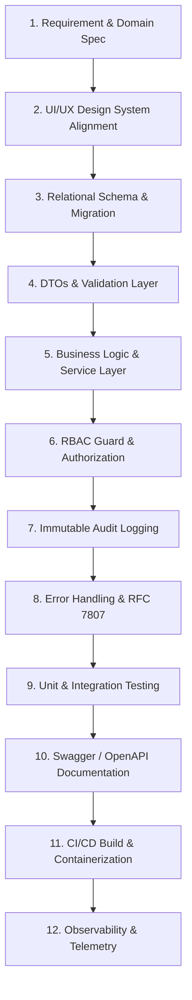

# PeopleOS — Definition of Done (DoD) & Engineering Quality Standards

To elevate **PeopleOS** from an academic prototype into a production-grade enterprise platform, every feature, endpoint, and UI view must satisfy this Definition of Done before being merged into the primary branch or promoted to a release candidate.

---

## 1. Feature Lifecycle Pipeline



---

## 2. Layer-by-Layer Verification Criteria

### 2.1 Database & Migrations
- [ ] Schema changes are executed exclusively via tracked ORM migrations (Prisma/TypeORM); manual DB edits are strictly forbidden.
- [ ] Foreign keys, cascading behaviors, and deletion policies (`ON DELETE RESTRICT` for primary records, `ON DELETE CASCADE` for child records) are explicitly defined.
- [ ] Composite and partial indexes exist for all queries filtered by `organization_id`, `department_id`, `status`, and `created_at`.
- [ ] Auditing columns (`created_at`, `updated_at`, `created_by`, `updated_by`, `deleted_at`) are present on all core tables.
- [ ] Rollback migration scripts are validated and testable.

### 2.2 Backend & API Architecture
- [ ] Adheres to the strict 5-tier architecture:
  $$\text{Controller} \longrightarrow \text{DTO Validation} \longrightarrow \text{Service} \longrightarrow \text{Repository} \longrightarrow \text{Database}$$
- [ ] DTOs use `class-validator` and `class-transformer` with `{ whitelist: true, forbidNonWhitelisted: true }` to reject unmapped payload attributes.
- [ ] Zero database operations occur inside controllers; controllers only parse requests, invoke services, and return DTOs.
- [ ] List endpoints implement standard pagination (`page`, `limit`, `sort`, `order`) capped at a maximum of 100 items.
- [ ] Mutations that affect multiple tables or state transitions are wrapped in atomic database transactions (`QueryRunner` / `$transaction`).

### 2.3 Security, RBAC & Audit
- [ ] Endpoints are guarded by `JwtAuthGuard` and `@RequirePermissions('resource:action')`.
- [ ] Row-level tenant or organization verification ensures users cannot access or modify records outside their organization.
- [ ] State-altering endpoints trigger non-blocking audit records capturing:
  - `user_id`, `client_ip`, `user_agent`, `action`, `resource`, `resource_id`, `old_value`, `new_value`.
- [ ] Passwords and sensitive PII are never logged or returned in API responses (enforced via response serialization interceptors).

### 2.4 Frontend & UI Standards
- [ ] Built with React 19, TypeScript (strict mode, zero `any` types), Tailwind CSS, and Headless UI / Radix primitives.
- [ ] States handled gracefully:
  - **Loading**: Custom skeleton screens (no jarring layout shifts).
  - **Empty**: Informative illustrations and call-to-action buttons.
  - **Error**: Granular field-level error messages and global toast alerts.
- [ ] Forms powered by `react-hook-form` with `zod` schema resolvers for client-side validation.
- [ ] Server state managed via `@tanstack/react-query` with proper cache invalidation keys.
- [ ] Fully responsive from mobile viewports (375px) to ultra-wide displays (1920px+).

### 2.5 Testing Standards
- [ ] **Unit Tests (Jest / Vitest)**: Minimum 80% line coverage on all business services and helper utilities.
- [ ] **Integration Tests (Supertest)**: End-to-end testing of controllers with an ephemeral test database (PostgreSQL in Docker).
- [ ] **Edge Cases**: Validated tests for negative conditions (e.g., unauthorized token, expired session, insufficient leave balance, duplicate unique constraints).

### 2.6 Documentation & Contracts
- [ ] OpenAPI / Swagger annotations on all controller routes with explicit `@ApiResponse` schemas (200, 400, 401, 403, 404, 422).
- [ ] Markdown documentation updated in `docs/` and `planning/` when introducing new architectural paradigms.

---

## 3. Pull Request (PR) Checklist Template

Before opening a PR, developers must confirm:

```markdown
### PeopleOS Quality Checklist
- [ ] Migration added and tested with rollback.
- [ ] Strict DTO validation applied on all input routes.
- [ ] RBAC permission guards verified for all roles (Admin, Manager, Employee).
- [ ] Audit log entry verified in `audit_logs` table for write operations.
- [ ] Unit & integration test suites passing locally (`npm run test:cov`).
- [ ] Swagger annotations updated and verified at `/api/docs`.
- [ ] Zero TypeScript compilation warnings or lint errors (`npm run lint`).
- [ ] Frontend handles Loading, Empty, and Error states cleanly.
- [ ] No hardcoded secrets, keys, or raw SQL queries.
```
