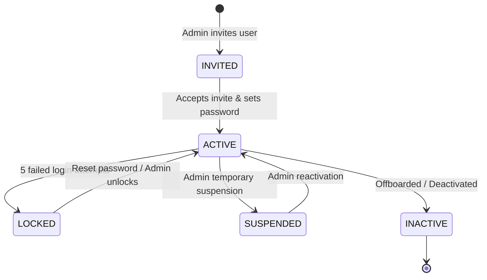
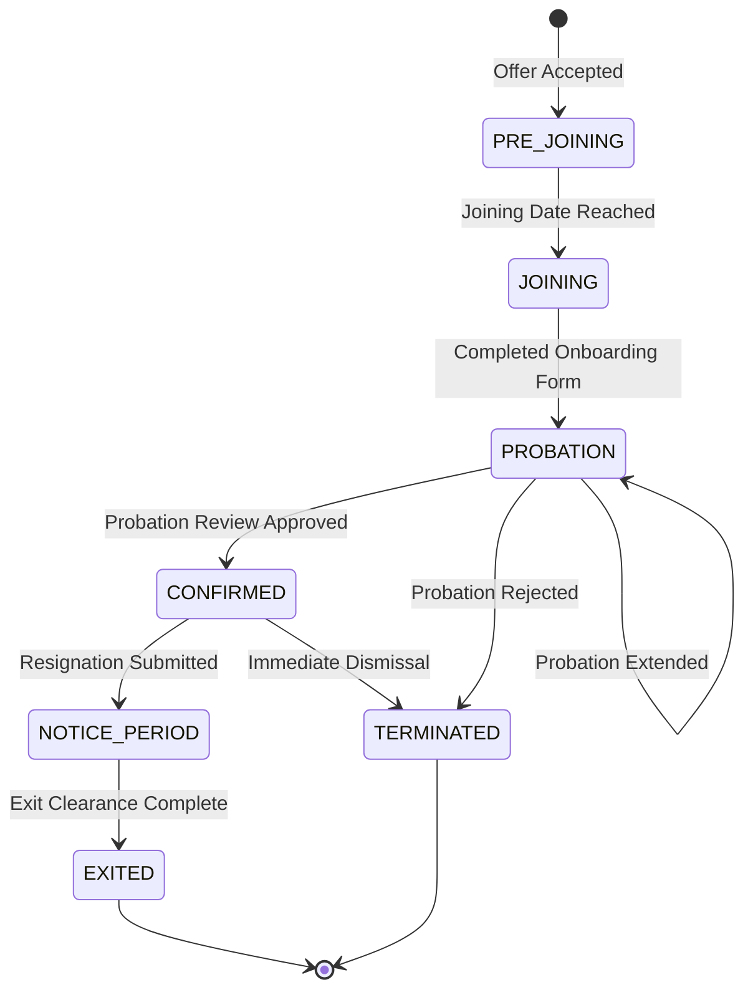

# PeopleOS — MVP Specification (Releases 1–3)

This specification defines the functional, data, and behavioral requirements for the **Minimum Viable Product (MVP)** of PeopleOS, comprising **Release 1 (Foundation)**, **Release 2 (Employee Operations)**, and **Release 3 (Attendance & Leave)**.

---

## 1. MVP Scope Overview

The MVP delivers a completely functional operational system capable of replacing legacy spreadsheets and disjointed tools:

```
┌─────────────────────────────────────────────────────────────────────────────┐
│                          PEOPLEOS MVP ARCHITECTURE                          │
├─────────────────────────┬─────────────────────────┬─────────────────────────┤
│       RELEASE 1         │       RELEASE 2         │       RELEASE 3         │
│       Foundation        │   Employee Operations   │   Attendance & Leave    │
├─────────────────────────┼─────────────────────────┼─────────────────────────┤
│ • Auth & User Provision │ • Employee Lifecycle    │ • Web Clock-In/Out      │
│ • Org Hierarchy & Tree  │ • Onboarding Checklists │ • Shifts & Rosters      │
│ • Employee Directory    │ • Probation Reviews     │ • Regularization        │
│ • Full Employee Profile │ • Central Approvals     │ • Leave Accruals        │
│ • Roles & Permissions   │ • Company Policies      │ • Leave Balances        │
│ • Audit Log Trail       │ • Holiday Calendars     │ • Leave Approval Flow   │
│ • Employee/HR Dashboard │ • Generic Requests      │ • Team Leave Calendar   │
└─────────────────────────┴─────────────────────────┴─────────────────────────┘
```

---

## 2. Release 1: Foundation Deep Dive

### 2.1 Authentication & User State Machine
All interactions require authentication via signed JSON Web Tokens.



- **Session Security**:
  - `access_token`: Stored in memory or Authorization Bearer header, expires in 15 minutes.
  - `refresh_token`: Stored in `httpOnly`, `Secure`, `SameSite=Strict` cookie, expires in 7 days.
  - Token blacklisting stored in Redis on user logout or password change.
  - Rate limiting on `/api/v1/auth/login`: Maximum 5 attempts per IP per 5 minutes.

### 2.2 Organization Structure
- **Departments**: Recursive tree structure with `parent_id` self-relation, assigned Department Head (`head_employee_id`), and optional Cost Center.
- **Designations**: Standardized job titles with assigned hierarchical level (e.g., Level 1 = Junior, Level 5 = Director) used for automated approval escalations.
- **Locations & Branches**: Physical sites with timezone specifications and regional assignment.

### 2.3 Employee Profile Data Model
The employee profile is partitioned into distinct sub-records:
1. **Core / Identity**: First name, Last name, Work email, Personal email, Phone, DOB, Gender, Blood group.
2. **Employment Details**: Employee ID code (e.g., `EMP-00104`), Date of joining, Employment type (Full-time, Part-time, Contract, Intern), Department, Designation, Reporting Manager.
3. **Contact & Address**: Current address, Permanent address, Emergency contacts (Name, Relationship, Contact number).
4. **Academics & Past Experience**: Degree, Institution, Year of passing, Previous employer names, Designations, Start/End dates.
5. **Skills & Certifications**: Skill name, Proficiency level (Beginner, Intermediate, Advanced, Expert).
6. **Documents Vault**: Uploaded PDFs/images categorized as Resume, Government ID, Educational Certificate, Signed Contract.

### 2.4 Role-Based Access Control (RBAC)
Permissions follow the pattern: `<Resource>:<Action>`:
- **Resources**: `User`, `Employee`, `Department`, `Designation`, `Attendance`, `Leave`, `Approval`, `AuditLog`.
- **Actions**: `Create`, `Read`, `Update`, `Delete`, `Approve`, `Export`, `Manage`.

Default system roles:
- `SUPER_ADMIN`: Unrestricted global system access.
- `HR_ADMIN`: Full access to Organization, Employee, Lifecycle, Attendance, and Leave modules.
- `MANAGER`: Read access to team profiles, approve team leaves, regularizations, and probation reviews.
- `EMPLOYEE`: Read own profile, edit personal contact details, clock-in/out, submit leaves and requests.

---

## 3. Release 2: Employee Operations Deep Dive

### 3.1 Employee Lifecycle State Engine


### 3.2 Digital Onboarding Engine
- **Checklist Categories**:
  - `HR`: Document verification, statutory enrollment, ID badge creation.
  - `IT`: Email account creation, laptop provisioning, VPN access.
  - `MANAGER`: Team introduction, 1:1 scheduling, 30-day goals definition.
  - `EMPLOYEE`: Profile data completion, bank details, emergency contacts, policy sign-offs.
- **Task Gating**: Configurable milestone gates (e.g., cannot transition from `JOINING` to `PROBATION` until 100% of critical documents are verified).

### 3.3 Probation Management
- Automatic notification triggers sent to Reporting Manager at **Day 30**, **Day 60**, and **Day 75** (for a standard 90-day probation).
- Manager submits recommendation:
  1. `CONFIRM`: Direct transition to `CONFIRMED` upon HR sign-off.
  2. `EXTEND`: Extend probation by 30 to 90 days with justification.
  3. `TERMINATE`: Trigger separation workflow.

### 3.4 Unified Approval Engine (v1)
Generic polymorphic approval framework handling:
- Leave requests, Attendance regularizations, Employee profile changes, Resignation requests.
- **Approval Chain Resolution**:
  ```
  Step 1: Immediate Reporting Manager (from Employee record)
  Step 2: Department Head (if duration > 3 days or sensitive request)
  Step 3: HR Admin (final sign-off)
  ```
- Capabilities: Inline commenting, approval delegation during manager leave, timeout escalations.

---

## 4. Release 3: Attendance & Leave Deep Dive

### 4.1 Attendance Time Tracking
- **Punches**: Records timestamp, device, IP address, coordinates (optional), and punch type (`CLOCK_IN`, `CLOCK_OUT`).
- **Calculations**:
  - **Total Work Hours**: Net hours worked excluding logged break durations.
  - **Late Arrival**: Clock-in timestamp $>$ Shift Start Time $+$ Grace Period (default: 15 mins).
  - **Early Departure**: Clock-out timestamp $<$ Shift End Time $-$ Grace Period.
  - **Overtime**: Work hours exceeding scheduled shift hours by $> 30\text{ mins}$.
- **Regularization**:
  - If employee forgets to punch or faces hardware issues, they can raise an `AttendanceRegularization` request specifying proposed in/out times and reason.
  - Requires manager approval to recalculate the day's record.

### 4.2 Shifts & Rostering
- **Standard Shifts**: e.g., Morning (`09:00 - 18:00`), Evening (`14:00 - 23:00`), Night (`22:00 - 07:00`).
- **Shift Assignments**: Assigned to individuals, entire departments, or rotated on a weekly/monthly basis.

### 4.3 Leave Engine
- **Leave Types**:
  - Casual Leave (CL)
  - Sick Leave (SL)
  - Earned / Privilege Leave (EL/PL)
  - Compensatory Off (Comp-Off)
  - Unpaid Leave / Loss of Pay (LOP)
- **Accrual Logic**:
  - Monthly accrual: $+1.5\text{ days}$ credited on 1st of every month.
  - Annual lump-sum: Credited on January 1st or April 1st.
  - Pro-rata calculation for mid-cycle joiners.
- **Balance Tracking**:
  $$\text{Available Balance} = \text{Opening Balance} + \text{Accrued} - \text{Used} - \text{Pending Approval}$$
- **Sandwich Rule (Configurable)**: If weekend/holiday falls between two leave days, count weekend as leave.

---

## 5. MVP Acceptance Test Suite

| Test ID | Module | Scenario | Expected Outcome |
| :--- | :--- | :--- | :--- |
| **TC-MVP-01** | Auth | User attempts login with invalid credentials 5 times | Account status transitions to `LOCKED`, returns HTTP 423 |
| **TC-MVP-02** | RBAC | Employee attempts to access `/api/v1/departments` (POST) | Returns HTTP 403 Forbidden with permission error |
| **TC-MVP-03** | Org | Admin deletes a department containing active employees | Throws validation error preventing orphan employee records |
| **TC-MVP-04** | Employee | HR creates new employee with mandatory fields | Employee record created, status set to `PRE_JOINING`, user account generated |
| **TC-MVP-05** | Lifecycle | New joiner completes all onboarding tasks | Onboarding status changes to `COMPLETED`, transitions to `PROBATION` |
| **TC-MVP-06** | Attendance | Employee clocks in at 09:10 on a 09:00 shift (15m grace) | Marked as `PRESENT`, `is_late = false` |
| **TC-MVP-07** | Attendance | Employee clocks in at 09:25 on a 09:00 shift (15m grace) | Marked as `PRESENT`, `is_late = true`, late minutes = 25 |
| **TC-MVP-08** | Leave | Employee applies for 3 days of Sick Leave with balance of 2 days | Form rejects submission: "Insufficient Leave Balance" |
| **TC-MVP-09** | Leave | Manager approves leave request | Status updates to `APPROVED`, deducted from available balance |
| **TC-MVP-10** | Audit | HR updates an employee's designation | New entry in `audit_logs` capturing old designation and new designation |
