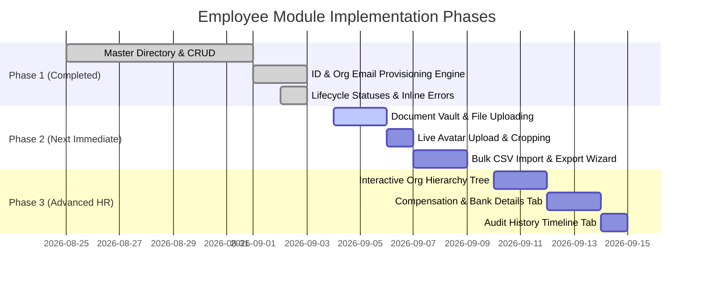

# Employee Module — Feature Roadmap & Development Plan
**Release Target**: Release 1 (`v1.0.0`)  
**Status**: Complete (Delivered in Release 1)  
**Last Updated**: September 8, 2026

---

## 1. Executive Summary

The **Employee Module** is the foundational core of PeopleOS HRM. It governs the entire employee lifecycle from candidate onboarding and account provisioning to organizational hierarchy, status changes, compliance document management, and departure offboarding.

This document details the **Current Implemented Foundation** and the **Next Phase Features** scheduled for completion.

---

## 2. Current Implemented Capabilities (Completed)

| Feature Area | Key Capabilities | Status |
| :--- | :--- | :--- |
| **Employee Directory** | Dual-mode view (Card Grid & Data Table), multi-attribute filters (Department, Designation, Employment Type, Status), global fuzzy search, server-side pagination. | ✅ Complete |
| **Server-Side ID Generation** | Cryptographically collision-resistant generation of `EMP-XXXXX` format with atomic database verification (never trusted from frontend). | ✅ Complete |
| **Account Provisioning** | Auto-generation of corporate email (`first.last@<domain>`), secure temporary initial password, linked `User` record creation with `EMPLOYEE` role. | ✅ Complete |
| **Onboarding Credentials** | HR credential dispatch modal, resend credential triggers, tracking of onboarding email dispatch status (`SENT`, `FAILED`, `PENDING`). | ✅ Complete |
| **Lifecycle Status Transitions** | Full status state machine (`ACTIVE`, `PROBATION`, `ON_LEAVE`, `SUSPENDED`, `RESIGNED`, `TERMINATED`, `INACTIVE`), transition dialog with effective dates and departure notes. | ✅ Complete |
| **Soft Delete & Offboarding** | Safe deactivation with `isDeleted: true`, `deletedAt` timestamp, and automatic revocation of linked user authentication access. | ✅ Complete |
| **Multi-Step Onboarding Form** | 5-step wizard covering Personal Identity, Department/Designation Assignment, Contact & Emergency, Education & Experience, and Account Review. | ✅ Complete |
| **Inline Validation System** | Strict inline field-level validation with subtle red borders (`border-rose-300`) and message labels directly below inputs (zero intrusive toast spam). | ✅ Complete |
| **Theme & Component Standardization** | Reusable `<Input />`, `<SelectField />` (custom searchable options with custom scrollbar, zero native select elements), consistent 36px height (`h-9`), and dark mode harmony. | ✅ Complete |

---

## 3. Next Phase Feature Roadmap

### Feature 1: Document Vault & Live File Upload (Priority: High)
*Enable compliant document storage, upload workflows, and HR review for verification.*

- **Live Upload Engine**: Support Drag & Drop / File Browser upload for formats (`PDF`, `PNG`, `JPG`) up to 10MB.
- **Document Categories**:
  - *Government & Identification*: Aadhaar Card, Passport, SSN/National ID, Driver's License, PAN Card.
  - *Employment & Compliance*: Signed Offer Letter, Employment Contract, Non-Disclosure Agreement (NDA), Background Verification Report.
  - *Academic & Certifications*: Degree Certificates, Marksheets, Professional Licenses.
  - *Financial & Tax*: Voided Cheque/Bank Statement, Tax Exemption Declarations.
- **Verification Workflow**:
  - HR Admin / Compliance Officer review queue.
  - Document status flags: `PENDING_REVIEW`, `VERIFIED`, `REJECTED`.
  - Rejection note feedback explaining what needs to be re-uploaded.
- **Secure Preview & Download**:
  - In-app modal viewer for PDFs and high-resolution images.
  - Secure time-limited pre-signed download URLs.

---

### Feature 2: Live Profile Picture & Avatar Cropping (Priority: High)
*Upgrade from the corporate default avatar to user-uploaded personalized profile photos.*

- **Upload & Interactive Cropper**:
  - Circular crop interface with pan and zoom.
  - Supported formats: PNG, JPG, WebP.
- **Client-Side Image Optimization**:
  - Auto-compress and scale to `256x256` and `512x512` avatars to prevent bloated database and bandwidth usage.
- **Reset to Corporate Default**:
  - Ability for HR Admin or Employee to reset profile picture back to the system default corporate avatar at any time.

---

### Feature 3: Bulk CSV / Excel Import & Export (Priority: High)
*Essential for enterprise onboarding, mass migrations, and external payroll reporting.*

- **Bulk CSV / Excel Export**:
  - One-click export of current filtered view or full employee roster.
  - Formats: CSV (`.csv`) and Excel (`.xlsx`).
  - Column selector (choose which personal or employment fields to include).
- **Bulk Employee Import Wizard**:
  - Step 1: Download pre-formatted CSV template (`peopleos_employee_import_template.csv`).
  - Step 2: Upload CSV with client-side syntax and column matching validation.
  - Step 3: Interactive Dry-Run preview highlighting duplicate emails, invalid dates, or missing mandatory fields in red.
  - Step 4: Batch execution with progress bar, auto-generating IDs, corporate emails, and linked user accounts in bulk.
  - Step 5: Import summary report with failed row download.

---

### Feature 4: Interactive Organizational Chart / Hierarchy Tree (Priority: Medium)
*Visual reporting lines mapping direct reports, team leads, and executive leadership.*

- **Visual Tree Nodes**:
  - Node-based hierarchical layout starting from CEO/Board down to individual contributors.
  - Cards show Employee Avatar, Full Name, Designation, Department, and Direct Report Count.
- **Interactive Navigation**:
  - Expand/collapse branch nodes.
  - Zoom, pan, and mini-map controls.
  - Search bar that auto-pans and highlights the searched employee in the tree.
- **Direct Manager Reassignment**:
  - Drag-and-drop or modal-based direct reporting transfer when restructuring teams.

---

### Feature 5: Compensation, Salary Structure & Bank Details (Priority: Medium)
*Store compensation package history and banking information under strict access controls.*

- **Bank Account Information**:
  - Bank Name, Account Number (masked: `••••••••1234`), Routing/IFSC Code, Swift/BIC, Branch Name.
  - Payment method selection: Direct Deposit / Wire / Cheque.
- **Salary Breakdown & CTC Structure**:
  - Base Salary, House Rent Allowance (HRA), Special Allowance, Medical Allowance, Performance Bonus.
  - Monthly Gross and Annual Cost-to-Company (CTC).
  - Currency support: INR (`₹`), USD (`$`), EUR (`€`), GBP (`£`).
- **Compensation History & Revision Log**:
  - Track promotion and salary hike history with effective dates and revised CTC.
- **Strict Role-Based Access Control (RBAC)**:
  - Compensation tab is hidden from general employees and standard managers.
  - Only accessible by `SUPER_ADMIN` and `HR_ADMIN`.

---

### Feature 6: Employee Audit Trail & Activity Timeline (Priority: Medium)
*Maintain a tamper-evident record of all changes made to an employee record.*

- **Tracked Events**:
  - Status changes (`PROBATION` $\rightarrow$ `ACTIVE`, `TERMINATED`, etc.).
  - Department, Designation, or Reporting Manager changes.
  - Contact info or bank detail updates.
  - Document uploads and verification decisions.
- **Activity Log Format**:
  - Event type, previous value, updated value, timestamp, IP address, and acting user (`Admin Marcus Chen`).
- **Timeline View**:
  - Tab 7 on the `EmployeeDetailPage` presenting an aesthetic, chronological vertical timeline.

---

## 4. Implementation Schedule & Phasing

---

## 5. Architectural Principles & Quality Standards

1. **Reusability First**: Every modal, form field, file dropzone, and badge must reside in shared component directories (`components/ui/`, `features/employees/components/`).
2. **Zero Native `<select>` Elements**: Every dropdown must use the project's `<SelectField />` with custom scrollbar, search, and keyboard navigation.
3. **No Intrusive Toast Validation**: Validation errors must render inline beneath the input field with `border-rose-300` and clear on edit.
4. **Data Isolation & Security**: Compensation and document files must be protected at both the API controller (`@UseGuards(RolesGuard)`) and database level.
